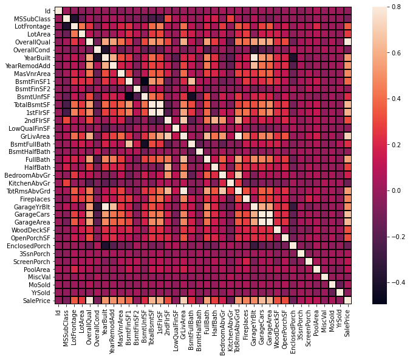

# PREDICTIVE ANALYSIS
Machine Learning: Predicting housing prices using advanced regression technique (Random Forest)

Tools: Python (Numpy, Pandas, Seaborn, Matplotlib, Scikit -learn)

Data Source: Kaggle (training/test data)  
 
 
**CONTENT**
- Exploratory Data Analysis
- Data Cleaning and Feature Selection
- Machine Learning Model Building / Training
- Prediction / Accuracy  

**EXPLORATORY DATA ANALYSIS** 
Before training and testing a machine learning model, it is important to understand the data to be used. This is the purpose of exploratory data analysis. The dataset used consist of 79 explanatory variables describing every aspect of redsidential homes in Ames, Iowa. By careful examination and preprecessing, relevant features will be selected and used to train model to predict the final selling price of a home. 
- Basement, lot and garage size
- Type of utilities available
- Neighbourhood
- Overall quality/condition of house
- Year built
- Sale type 

Visualizing the correlation between the numerical features and sales price using a correlation plot, I observed 10 numerical variables with a correlation of at least 0.5 with housing sale price.

|Features | Correlation |
| ------- | ----------- |
|OverallQual | 0.790982 |
|GrLivArea | 0.708624 |
|GarageCars | 0.640409 |
|GarageArea | 0.623431 |
|TotalBsmtSF | 0.613581 |
|1stFlrSF | 0.605852 |
|FullBath |  0.560664 |
|TotRmsAbvGrd | 0.533723 |
|YearBuilt | 0.522897 |
|YearRemodAdd |0.507101|

Overall material and finish of the house has the highest correlation. This makes alot of sense because houses with higher quality finishes will cost more. The next feature with high correlation is the above ground living area. This features relates the size of the house which will difinitely influence sales price.
